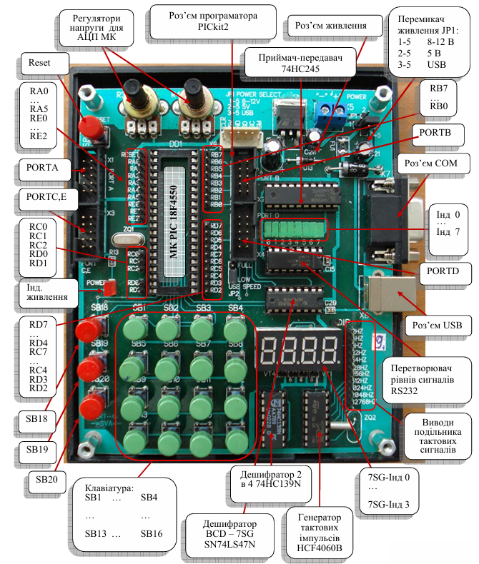
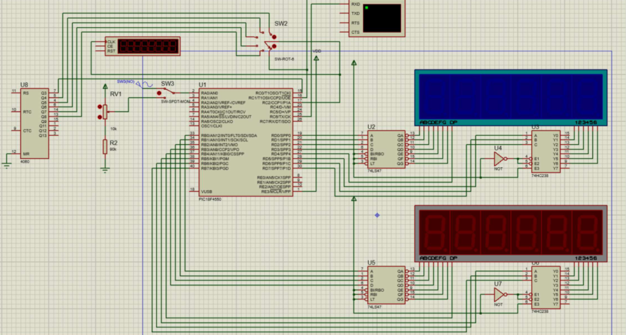
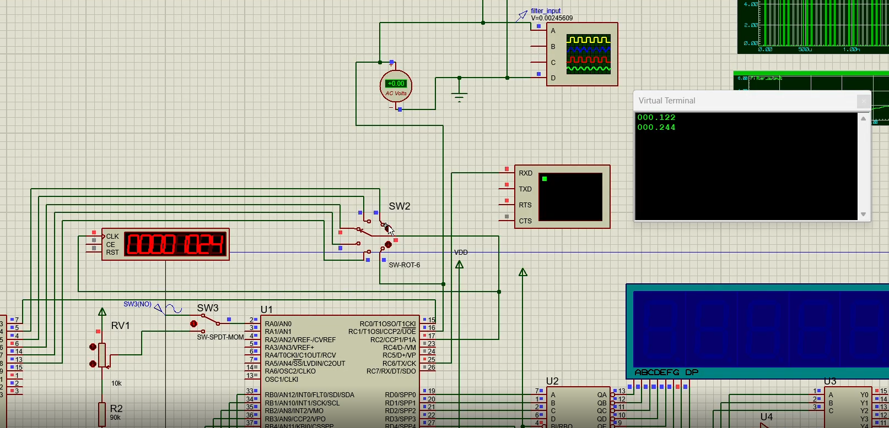

# PIC18F4550 Embedded Systems

Low-level embedded systems projects developed for the PIC18F4550 microcontroller using Assembly and C.  
The projects focus on MCU peripherals, register-level configuration, timing, interrupts, UART communication, PWM generation, and simulation-based debugging in Proteus/MPLAB.

## Overview

This repository contains academic embedded systems projects based on the PIC18F4550 microcontroller.  
The main goal was to understand how microcontroller peripherals work at the register level and how they interact with external devices such as displays, keypads, terminal interfaces, and PWM-controlled outputs.

## Key Features

- ADC configuration and signal reading
- UART/USART terminal communication
- Timers and interrupt handling
- PWM generation and control
- CCP Capture for pulse measurement
- GPIO and port configuration
- Dynamic 7-segment indication
- Matrix keypad scanning
- BCD conversion
- Proteus simulation and debugging

## Technologies and Tools

- PIC18F4550
- Assembly
- C
- MPLAB
- Microchip C18
- Proteus
- UART/USART
- ADC
- PWM
- Timers
- Interrupts
- CCP Capture
- GPIO

## Project Examples

### UART Terminal Communication

Implemented UART communication between the PIC18F4550 and a virtual terminal in Proteus.  
The project demonstrates serial communication, command handling, and terminal-based interaction.

### PWM Control

Configured PWM generation using PIC18F4550 peripherals.  
The project demonstrates timer configuration, PWM output control, and peripheral-level setup.

### ADC-Based PWM Adjustment

Implemented ADC reading and used the measured value to adjust PWM behavior.  
This demonstrates interaction between analog input, digital processing, and output signal generation.

### 7-Segment Display and Matrix Keypad

Implemented dynamic indication and keypad scanning logic.  
The project demonstrates display multiplexing, input handling, and embedded timing logic.

## Images

Add screenshots here:

```markdown





